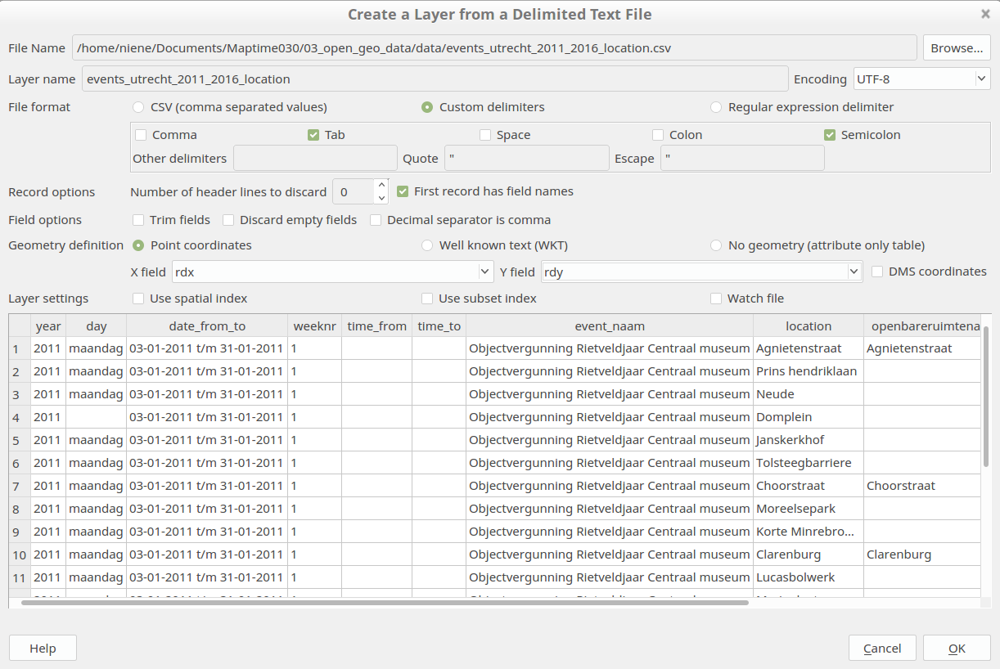

# DIY Dutch Open Geo Data

From Frank Verschoor we got an [Excel file with all the events in Utrecht from 2011 to 2016](data/Evenementenoverzicht 2011 t-m 2016.xlsx). This events have a data, time and location. 

**Let's map this!**

So how do we do this? Because the dataset did not contain any coordinates we first need to geo refer these locations. For this we can use the BAG with all the addresses. Below you can see the steps I took to get coordinates to our dataset!

By cloning this repository you can reproduce these steps for yourself in Postgis. 

You do not want to work with Postgis? The pre-processed dataset with location is available for you as [CSV](/data/events_utrecht_2011_2016_location.csv) or [GeoJSON](/data/events_utrecht_2011_2016_location.geojson)! Just download this and import this to Qgis, R or anything you like!

**Good luck!**

## Geolocating location names:

#### 1. Excel to csv
[The original excel file](data/Evenementenoverzicht 2011 t-m 2016.xlsx) has a tab sheet per year. Put all data into one sheet with the year as extra column. From year 2014 the columns for week and time are switched, correct this manually. By doing this the total dataset can be exported to a [working csv file](data/Evenementenoverzicht_2011_2016.csv). Saving as an csv only works for the active tab sheet. 

#### 2. csv to Postgis
When you have Postgis running you can import the csv file with the [import script](sql_scripts/import_csv.sql) on the command line. Fill in your own existing database name, user, port and password. 

	psql -h localhost -d database -U user -p port -f sql_scripts/import_csv.sql

#### 3. BAG to Postgis 
Now we need to download the BAG and put in the same database of Postgis with pg_restore. Again, fill in your own existing database name, user, port and password. 

	wget data.nlextract.nl/bag/postgis/bag-laatst.backup 

	pg_restore --create --exit-on-error --verbose -h localhost -d database -U user -p port -j `nproc` --no-owner --no-privileges bag-2016_10_13.backup

#### 4. Geocoding in PostGIS 
We only need the addresses in Utrecht. Plus we need only one point per street because we do not have full addresses. There are 2 choices for this, either we take the centre of the addresses per street or the first GID of the street as our location point.

In [this script](sql_scripts/bag_adres.sql) you can see the steps we take to create a table with all the information and the coordinates in RDnew and Lat Long. 

	psql -h localhost -d database -U user -p port -f sql_scripts/bag_adres.sql

Export our table to a workable csv file for you to use! (or use the postgis database)

	psql -h localhost -d database -U user -p port -f sql_scripts/export_csv.sql

[The csv with coordinates](data/events_utrecht_2011_2016_location.csv) can be imported in Qgis for example. Download the file open Qgis and follow the following steps:

Go to `Layer` > `Add Layer` > `Add Delimited Text File.. `

Use the following settings: 

